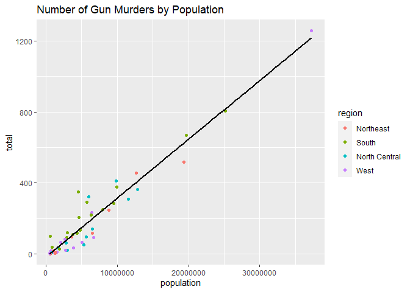

Assignment 5
================

## What was the relationship between population size and the number of gun murders in 2010?

    ## Warning: package 'dslabs' was built under R version 4.0.5

``` r
options(scipen = 999)
ggplot(murders, aes(x = population, y = total)) +
  geom_point(aes(color = region)) + 
  ggtitle("Number of Gun Murders by Population") +
  geom_smooth(method = "lm", se = FALSE, color = 'black')
```

    ## `geom_smooth()` using formula 'y ~ x'

<!-- -->

The plot shows that the number of gun murders per state in 2010
increases as population increases, independent of which region the state
is in.

  

  

  

  
